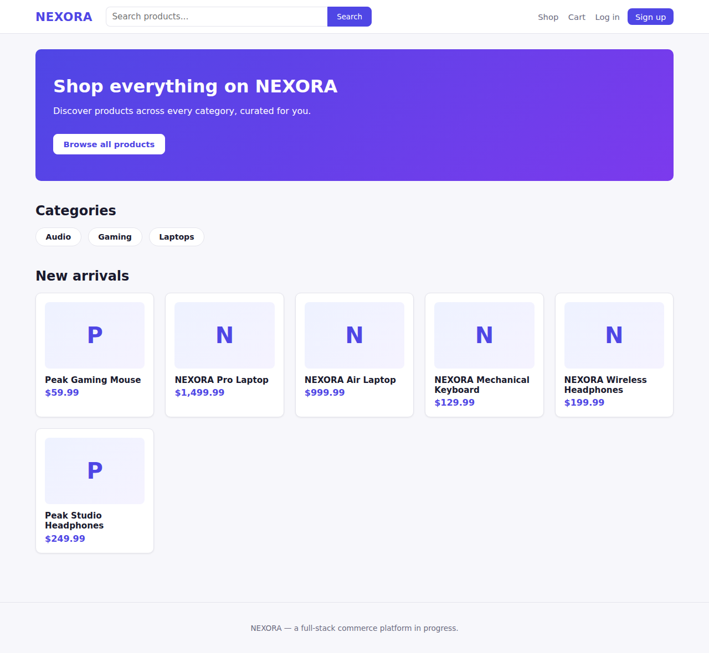
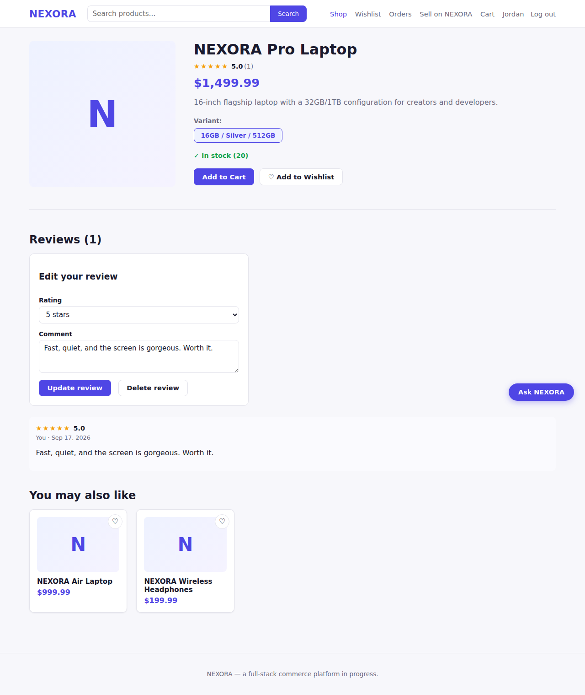
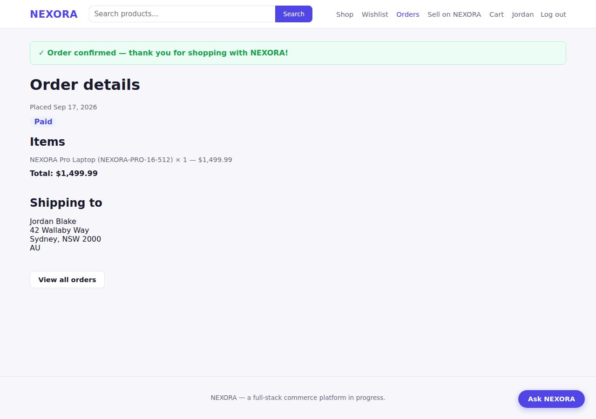
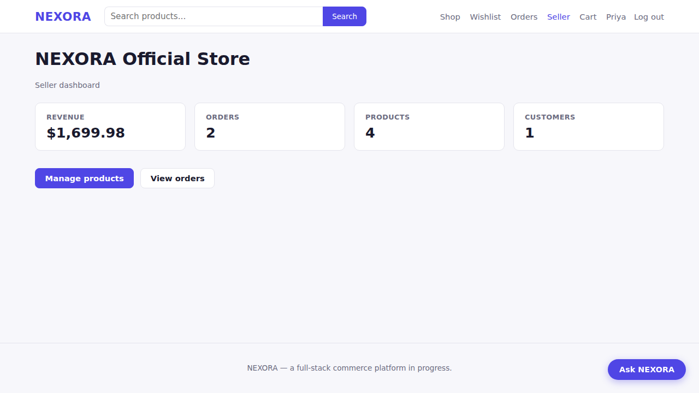
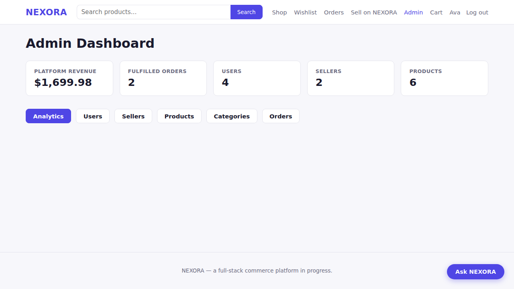
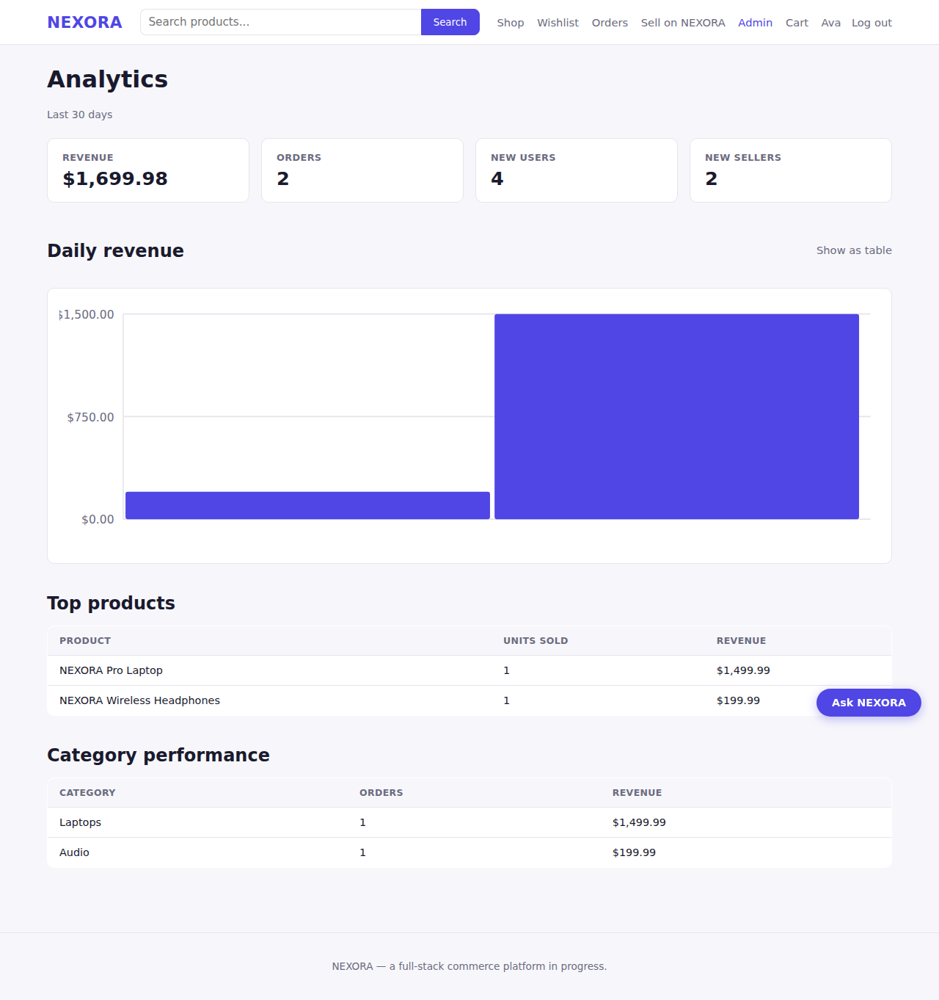
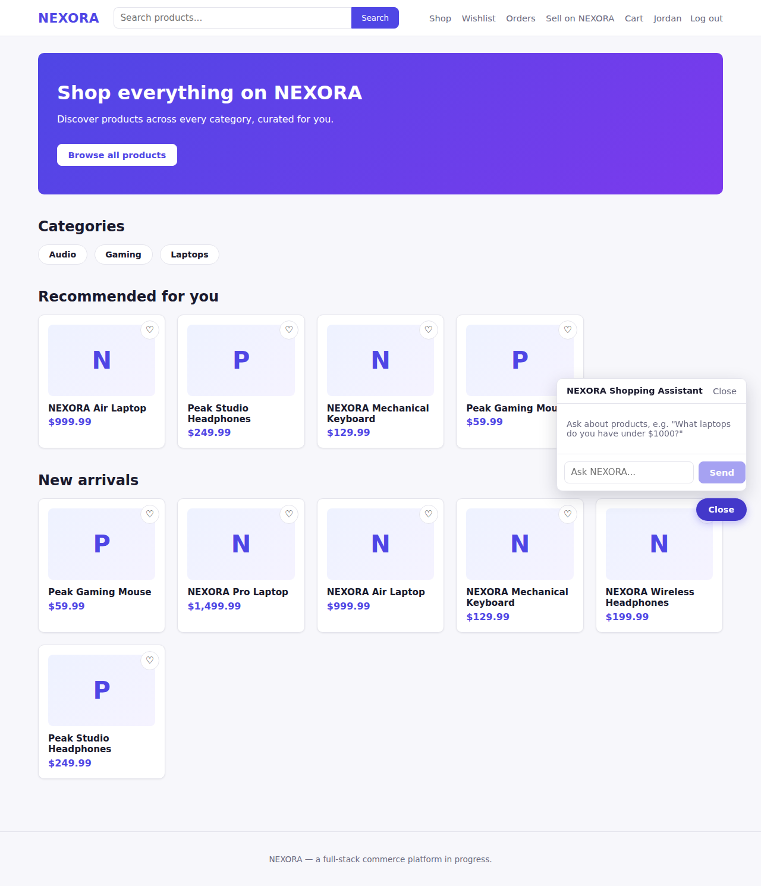

# NEXORA

A full-stack e-commerce platform: FastAPI + PostgreSQL backend, React + TypeScript
storefront, seller and admin dashboards, an AI shopping assistant, and the
infrastructure to run it — built end to end as a portfolio project.

[](https://render.com/deploy?repo=https://github.com/adi106/Nexora)



## What's here

NEXORA is a marketplace: buyers browse and buy, sellers list and fulfill, admins
moderate and watch the numbers.

- **Storefront** — category browsing, search with relevance ranking, filters
  (price/category/stock), product detail with variants, reviews, wishlist, and
  item-based "customers who bought this also bought" recommendations.
- **Checkout** — cart → address → mock payment → order confirmation, with real
  inventory reservation and a payment-failure path that releases stock.
- **Seller dashboard** — self-service onboarding, product/variant/inventory CRUD,
  order fulfillment, and store stats (revenue, orders, products, customers).
- **Admin dashboard** — platform stats, user/seller suspension, cross-seller
  product moderation, category management, and an analytics view (daily revenue,
  top products, category performance) built on the app's own order data.
- **AI shopping assistant** — a chat widget grounded in the live product catalog
  (retrieval + Claude), not a generic chatbot; says so plainly when nothing in
  the catalog fits rather than inventing an answer.

| | | |
|---|---|---|
|  |  |  |
|  |  |  |

## Tech stack

| Layer | Choices |
|---|---|
| Backend | FastAPI, SQLAlchemy 2, Alembic, Pydantic v2, PostgreSQL |
| Auth | JWT (PyJWT), Argon2 password hashing (pwdlib) |
| Frontend | React 19, TypeScript, Vite, React Router |
| AI | Anthropic Claude API (Python SDK), retrieval over the product catalog |
| Infra | Docker, docker-compose, GitHub Actions CI, one-click Render deploy (`render.yaml`) |
| Tests | pytest (218 backend tests), Playwright-verified frontend flows |

## Architecture

```
┌──────────────┐        HTTPS/JSON        ┌───────────────────┐
│  React SPA   │ ───────────────────────▶ │   FastAPI backend  │
│  (Vite, TS)  │ ◀─────────────────────── │  (uvicorn, Pydantic)│
└──────────────┘                          └─────────┬───────────┘
                                                     │  SQLAlchemy
                                                     ▼
                                          ┌───────────────────┐
                                          │    PostgreSQL      │
                                          └───────────────────┘
                                                     ▲
                                          ┌──────────┴──────────┐
                                          │ Reservation-cleanup  │
                                          │ background worker    │
                                          └──────────────────────┘

FastAPI ──▶ Anthropic API (Claude)   — AI shopping assistant, optional
                                       (needs ANTHROPIC_API_KEY)
```

The backend is a single FastAPI app (`backend/app`) organized by domain:
`api/v1/*` (routers), `models/*` (SQLAlchemy ORM), `schemas/*` (Pydantic
request/response contracts), `services/*` (business logic — order lifecycle,
recommendations, the AI assistant's retrieval step). Role-based access
(customer/seller/admin) is enforced per-endpoint via a `require_role` dependency,
not baked into the JWT.

## Getting started

### Option A: Docker Compose

```bash
cp .env.example .env   # fill in JWT_SECRET_KEY; ANTHROPIC_API_KEY is optional
docker compose up --build
```

- Frontend: http://localhost:5173
- Backend: http://localhost:8000 (interactive docs at `/docs`)

> This repo's Dockerfiles and compose config were validated for syntax
> (`docker compose config`) but not built/run, since this development
> environment has no Docker daemon available. Please confirm
> `docker compose up --build` works for you before relying on it.

### Option B: Run locally

Requires Python 3.11+, Node 22+, and a local PostgreSQL 17 (or use
`docker compose up postgres` for just the database).

```bash
# Database
createdb nexora
cp .env.example .env   # set DATABASE_URL/JWT_SECRET_KEY for local postgres

# Backend
python -m venv .venv && source .venv/bin/activate
pip install -r backend/requirements.txt
alembic upgrade head
uvicorn backend.app.main:app --reload

# Frontend (separate terminal)
cd frontend
npm install
npm run dev
```

### Option C: One-click deploy (Render)

Click the **Deploy to Render** badge above (or go to
[render.com/deploy?repo=…](https://render.com/deploy?repo=https://github.com/adi106/Nexora)).
Render reads [`render.yaml`](render.yaml) and provisions three resources under
your own Render account:

- a free PostgreSQL database,
- the FastAPI backend as a Docker web service (runs migrations on boot),
- the React frontend as a static site, built with `VITE_API_BASE_URL`
  pointed at the backend automatically.

`JWT_SECRET_KEY` is generated for you, and `CORS_ORIGINS` is wired to the
frontend's Render URL automatically — no manual URL copying required. Two
things you may want to do afterward:

- **Enable the AI assistant**: add `ANTHROPIC_API_KEY` on the `nexora-backend`
  service in the Render dashboard (Environment tab), then trigger a manual
  redeploy. It's left blank by default so the blueprint deploys without
  requiring an API key.
- **Free-tier behavior to expect**: the free database expires 30 days after
  creation (upgrade it in the Render dashboard to keep it), and the free
  backend service spins down after 15 minutes of inactivity — the first
  request after a period of idleness takes 30-60 seconds to wake it up.

### Running tests

```bash
# Backend — needs a nexora_test database (see tests/conftest.py for the DSN)
pytest tests/ -q

# Frontend
cd frontend
npm run build   # tsc -b && vite build
npm run lint
```

## Environment variables

See `.env.example` for the full list. `ANTHROPIC_API_KEY` is the only truly
optional one — without it, the AI assistant endpoint returns a clear 503
instead of failing silently or faking a response. `CORS_ORIGINS` defaults to
the local Vite dev server and only needs to change if you deploy the frontend
somewhere other than `localhost:5173` (the Render blueprint sets it
automatically).

## Project structure

```
backend/
  app/
    api/v1/        FastAPI routers (one file per resource)
    models/        SQLAlchemy ORM models
    schemas/       Pydantic request/response schemas
    services/      Business logic (orders, recommendations, AI assistant)
    core/          Auth, rate limiting, security headers, request logging
    db/            Session/engine setup, seed scripts
  alembic/         Database migrations
  worker/          Reservation-cleanup background worker
frontend/
  src/
    api/           Typed API client, one module per resource
    pages/         Route-level components (storefront, seller, admin)
    components/    Shared UI (product card, layout, forms, chat widget)
    context/       Auth/cart/wishlist React context providers
tests/             Backend test suite (pytest)
.github/workflows/ CI (lint, typecheck, build, test)
```

## Notes on scope

This is a portfolio project, and some infrastructure was deliberately kept
lightweight rather than adding services this project doesn't yet need:

- **Payments** use a mock provider (`services/payment_service.py`) rather than
  a real gateway, so the checkout flow works without a Stripe account.
- **Rate limiting** is in-memory and process-local (see `core/rate_limit.py`) —
  correct for a single instance, would need a shared store (Redis) behind a
  load balancer.
- **Search** is PostgreSQL `ILIKE` with a relevance scoring pass, not a
  dedicated search engine — documented as the first thing to swap for
  OpenSearch/Elasticsearch if the catalog outgrows it.
- **Analytics** are computed directly from the application's own Postgres
  tables, not a separate warehouse/ETL pipeline.
- **Recommendations** use real item-based collaborative filtering (order
  co-occurrence) and category-affinity heuristics — not a trained ML model.

Each of these is a reasonable next step, not a gap that blocks the app from
working correctly today.
